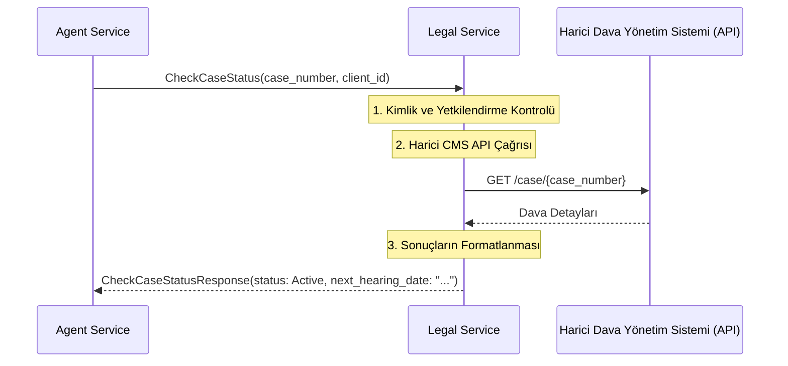

# 🏛️ Sentiric Vertical Legal Service - Mantık ve Akış Mimarisi

**Stratejik Rol:** Hukuk ve dava yönetimi süreçlerine odaklanan dikey iş mantığını içerir. Müşterilerin dava durumlarını, sonraki duruşma tarihlerini veya yasal belge taleplerini yönetmek için bir arayüz sağlar.

---

## 1. Temel Akış: Dava Durumu Kontrolü (CheckCaseStatus)

## 2. Hassas Veri Yönetimi

Legal Service, dava bilgileri gibi son derece hassas müşteri verilerini işler. Bu nedenle, giden bağlantılarda ve kimlik doğrulamasında en katı güvenlik standartlarını (mTLS, katmanlı yetkilendirme) uygulamalıdır.